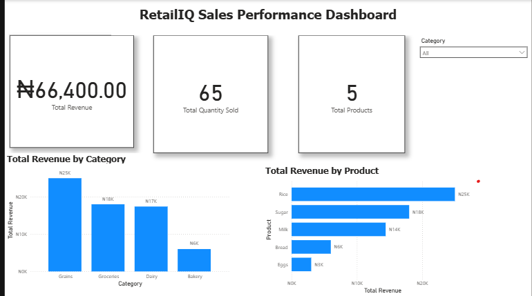

# RetailIQ

## Project Overview

RetailIQ is an end-to-end retail data project that demonstrates how raw sales data can be transformed into meaningful business insights using Python, Pandas, MySQL, SQL, Power BI, Git, and GitHub.

The project follows a complete data workflow: loading and processing CSV data with Python, storing structured data in a MySQL database, analyzing sales performance with SQL, and presenting key business insights through an interactive Power BI dashboard.

The project is designed to demonstrate practical Data Analysis and Data Engineering skills through a real-world retail sales scenario.

## Power BI Dashboard

The RetailIQ Power BI dashboard provides an interactive overview of retail sales performance, including total revenue, quantity sold, product performance, and revenue by category.

---
## Project Architecture

RetailIQ follows an end-to-end data workflow:

CSV Files → Python/Pandas → MySQL Database → SQL Analysis → Power BI Dashboard

### Data Flow

1. Raw sales and product data are stored in CSV files.
2. Python and Pandas read and prepare the datasets.
3. The Python data pipeline loads the data into MySQL.
4. SQL joins and aggregations are used to analyze sales performance.
5. Power BI connects to MySQL and visualizes the results.
6. Git and GitHub are used for version control and project documentation.

## Technologies Used

- **Python** — Data processing and pipeline development
- **Pandas** — Data cleaning, transformation, and analysis
- **MySQL** — Relational database for storing sales and product data
- **SQL** — Data querying, joins, aggregation, and analysis
- **Power BI** — Interactive dashboard and data visualization
- **DAX** — Creation of dashboard measures and KPIs
- **Matplotlib** — Python-based data visualization
- **Git** — Version control
- **GitHub** — Project hosting and documentation

---
## Key Business Insights

- Total revenue generated: **₦66,400**
- Total quantity sold: **65 units**
- Total products analyzed: **5**
- **Rice** generated the highest product revenue at **₦25,000**
- **Grains** was the highest-performing category with **₦25,000** in revenue
- Rice contributed approximately **37.65%** of total revenue
- Rice, Milk, and Sugar each contributed more than 20% of total revenue

---
## Project Structure

RetailIQ/
│
├── data/
│   ├── sales.csv
│   └── products.csv
│
├── src/
│   ├── main.py
│   └── database.py
│
├── reports/
│   ├── revenue_by_category.png
│   └── RetailIQ_Dashboard.png
│
├── sql/
│   └── analysis.sql
│
├── PowerBI/
│   └── RetailIQ_Dashboard.pbix
│
└── README.md

---
---
Project Status: 🚧 In Progress