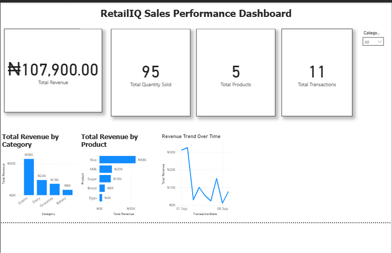

# RetailIQ

## Project Overview

RetailIQ is an end-to-end retail data project that demonstrates how raw sales data can be transformed into meaningful business insights using Python, Pandas, MySQL, SQL, Power BI, Git, and GitHub.

The project follows a complete data workflow: loading and processing CSV data with Python, storing structured data in a MySQL database, analyzing sales performance with SQL, and presenting key business insights through an interactive Power BI dashboard.

The project is designed to demonstrate practical Data Analysis and Data Engineering skills through a real-world retail sales scenario.

## Power BI Dashboard

The RetailIQ Power BI dashboard provides an interactive overview of retail sales performance, including total revenue, quantity sold, product performance, and revenue by category.

---
## Project Architecture

RetailIQ follows an end-to-end data workflow:

CSV Files → Python/Pandas → MySQL Database → SQL Analysis → Power BI Dashboard
### Data Model

RetailIQ uses a relational database structure with two main tables:

- **products** — stores each unique product and its category.
- **sales** — stores individual sales transactions.

The tables are connected through `ProductID`:

products (1) → (*) sales

`ProductID` is the primary key in the `products` table and a foreign key in the `sales` table, creating a one-to-many relationship where one product can appear in multiple sales transactions.
### Incremental Data Pipeline

RetailIQ uses an incremental loading approach to avoid unnecessary full database reloads.

- Existing products retain their ProductID.
- New products are inserted only when they do not already exist.
- Each sales transaction has a unique TransactionID.
- Previously loaded transactions are skipped automatically.
- New transactions are inserted without duplicating existing records.
- Database transactions use commit and rollback handling to protect data integrity if a pipeline run fails.

### Data Flow

1. Raw sales and product data are stored in CSV files.
2. Python and Pandas read and prepare the datasets.
3. The Python data pipeline loads the data into MySQL.
4. SQL joins and aggregations are used to analyze sales performance.
5. Power BI connects to MySQL and visualizes the results.
6. Git and GitHub are used for version control and project documentation.

## Technologies Used

- **Python** — Data processing and pipeline development
- **Pandas** — Data cleaning, transformation, and analysis
- **MySQL** — Relational database for storing sales and product data
- **SQL** — Data querying, joins, aggregation, and analysis
- **Power BI** — Interactive dashboard and data visualization
- **DAX** — Creation of dashboard measures and KPIs
- **Matplotlib** — Python-based data visualization
- **Git** — Version control
- **GitHub** — Project hosting and documentation

---
## Key Business Insights

- Total Revenue: ₦107,900
- Total Quantity Sold: 95 units
- Total Unique Products: 5
- Total Sales Transactions: 11
- Rice generated the highest product revenue at ₦57,500.
- Grains was the highest-performing category with ₦57,500 in revenue.
- Dairy generated ₦24,000 in revenue.
- Eggs recorded the highest quantity sold at 42 units.
- Transaction-level dates enable daily revenue trend analysis.
---
## Project Structure

RetailIQ/
│
├── data/
│   ├── sales.csv
│   └── products.csv
│
├── src/
│   ├── main.py
│   └── database.py
│
├── reports/
│   ├── revenue_by_category.png
│   └── RetailIQ_Dashboard.png
│
├── sql/
│   └── analysis.sql
│
├── PowerBI/
│   └── RetailIQ_Dashboard.pbix
│
└── README.md

---
---
Project Status: 🚧 In Progress